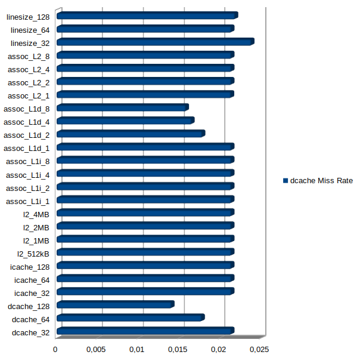
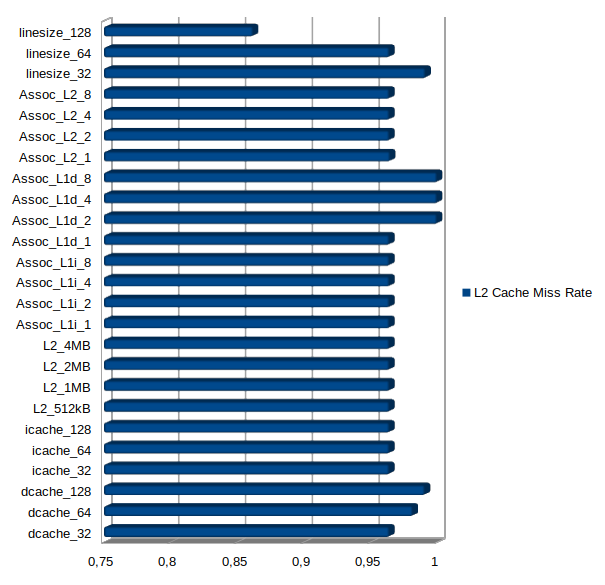
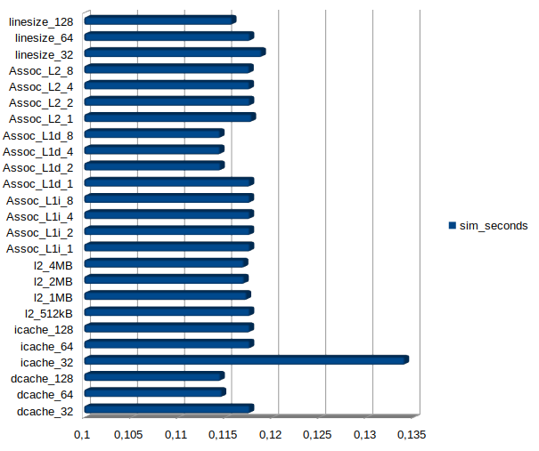

# README

***

Αυτό το repository έχει δημιουργηθεί στο πλαίσιο του μαθήματος Αρχιτεκτονική Υπολογιστών και αποτελείται από τα αρχεία που απαιτούνται για την απάντηση των ερωτημάτων του φυλλαδίου του δεύτερου εργαστηρίου. Ακολουθεί:

## Αναφορά 2ου Εργαστηρίου Αρχιτεκτονικής Υπολογιστών
## Βημα 1
### Ερώτημα 1
Για την εκτέλεση των πρώτων εξομοιώσεων των Benchmark έγινε χρήση ενός απλού script bash με όνομα **bench_firstrun.sh** το οποίο βρίσκεται στον φάκελο Lab2/, τα αποτελέσματα αυτού του script βρίσκονται στον φάκελο spec_results.  
Μετά την εκτέλεση των αρχικών εξομοιώσεων, με την βοήθεια του αρχείου config.ini βρέθηκαν οι ακόλουθες τιμές για τα ζητούμενα του ερωτήματος 1. Δίπλα παρατείθεται η γραμμή του αρχείου config.ini για το benchmark specbzip όπου βρέθηκε η πληροφορία.

+ L1 instruction size = 32 kB         Γραμμή 813
+ Associativity L1 Instruction = 2    Γραμμή 793
+ L1 Data size = 64 kB                Γραμμη 179
+ Associativity L1 Data = 2           Γραμμή 159
+ L2 size = 2MB                       Γραμμή 1018
+ Associativity L2 = 8                Γραμμή 998
+ cache_line_size=64                  Γραμμή 15

### Ερώτημα 2 

Βρέθηκαν στα αρχεία stats.txt των επιμέρους benchmarks 
+ ο χρόνος εκτέλεσης
+ CPI
+ overall miss rates για τις μνήμες icache, dcache και  L2 Cache

Μετά απο την εξαγωγή των αποτελεσματων με την χρήση του read_results.sh που παρέχεται, εγιναν 5 ξεχωριστά γραφήματα τα οποία συγκρίνουν τις αποδόσεις μεταξύ των Benchmarks. Παρουσιάζονται και σε αυτό το αρχείο κάτωθι αλλά υπάρχουν και στον φάκελο *Lab2/Charts1/*.

**Χρόνος Εκτέλεσης**

**CPI** 

**Data Cache Miss Rate**

**Instruction Cache Miss Rate**

**L2 Cache Miss Rate**

Από τα γραφήματα παρατηρείται πως το Benchmark *specsjeng* είχε τον μεγαλύτερο χρόνο εκτέλεσης, CPI ,dcache miss rate και L2Cache miss rate ενώ είχε το μικρότερο Ιcache miss rate.  
Το *spechmmer* μπορεί να είχε χαμηλό χρόνο εκτέλεσης, CPI, Dcache και L2Cache miss rate αλλά είχε το υψηλότερο ICache miss rate από όλα τα benchmarks.  
To *specbzip* είχε χαμηλό χρονο εκτέλεσης, CPI και miss rates σε όλες τις cache.  
To *speclibm* είχε μέτριο συγκριτικά χρόνο εκτέλεσης όπως φυσικά και CPI, είχε επίσης μέτριο DCache miss rate, χαμηλό icache instruction rate και υψηλό l2 cache miss rate.
To *specmcf* είχε χαμηλό χρόνο εκτέλεσης, CPI, dcache miss rate και icache miss rate ενώ είχε κάπως υψηλό L2 cache Miss Rate.
### Ερώτημα 3

Για να τρέξουμε τα benchmarks με ρολόι CPU 1GHz έγινε χρήση ενός απλού script bash, το οποίο βρίσκεται στο φάκελο Lab2 με ονομα **bench_secondrun.sh**. Τα αποτελέσματα αυτού του script βρίσκονται στον φάκελο Lab2/spec_results2/ ενώ για την εξαγωγή των τιμών έγινε η χρήση του read_results.sh που παρέχεται με την άσκηση. Στο αρχείο Stats.txt βρέθηκαν 2 εγγραφές με ρολόγια. Το ένα είναι το  *system.clk_domain.clock* και το άλλο είναι το *system.cpu_clk_domain.clock*. Το πρώτο όπου και στις 2 περιπτώσεις είχε τιμή 1 GHz είναι το ρολόι συγχρονισμού του συστήματος ενώ το 2ο είναι το ρολόι χρονισμού της CPU. Την πρώτη φορά που έτρεξαν τα benchmark είχε χρονισμό στα  2 GHz ενω την 2η αφού δηλώθηκε, ο χρονισμός ήταν στο 1 GHz.  
Σε περίπτωση που προστεθεί ακόμα ένας επεξεργαστής λογικά ο χρονισμός του θα είναι αυτός που έχει δηλωθεί κατα την εκτέλεση του αρχείου .py(σε αυτήν την περίπτωση se.py). Εάν δεν δηλωθεί τιμή θα είναι η default. Σε αυτήν την περίπτωση τα 2 GHz.

Παρατηρώντας τους χρόνους εκτέλεσης για --cpu-clock=1GΗz βλέπουμε πως δεν υπαρχει τέλειο scaling σε όλα. Σε κάποια Benchmark υπάρχει μια πάρα πολύ καλή προσέγγιση. Συγκεκριμένα στα specbzip, spechmmer και specmcf παρατηρείται πως οι πραγματικές τιμές είναι κοντά στις αναμενόμενες ενώ στο speclibm και specsjeng υπάρχει μεγαλύτερο σφάλμα. Το μεγαλύτερο σφάλμα παρουσιάζεται στα benchmark όπου έχουν υψηλό χρόνο εκτέλεσης λόγω υψηλού CPI. Αυτό κατά πάσα πιθανότητα οφείλεται στο γεγονός ότι τα προβλήματα αυτά είναι memory bound οπότε και να διπλασιαστεί ή ακόμα να διαιρεθεί η υπολογιστική ισχύς του επεξεργαστή δεν θα συμβάλει στην γρηγορότερη επίλυση του προβλήματος καθώς φαίνονται να είναι προβλήματα αργής προσπέλασης της μνήμης.

## Βήμα 2

### Ερώτημα 1

Για την υλοποίηση των δοκιμών του 2ου βήματος η διαδικασία που ακολουθήθηκε είναι η εξής. Ο χρονισμός του ρολογιού της CPU τέθηκε στα 1GHz και επιλέχθηκαν ως "default" τιμές οι παρακάτω:  
+ L1 instruction cache size             64kb
+ L1 instruction cache associativity    1
+ L1 data cache size                    32kb
+ L1 data cache associativity           1
+ L2 cache size                         512kb
+ L2 cache associativity                2
+ Μέγεθος cache line                    64kb

 Σε κάθε benchmark έγιναν 25 εκτελέσεις. Διατηρώντας σταθερές τις "default" τιμές έγιναν διαδοχικές εκτελέσεις με αλλαγή μιας παραμέτρου κάθε φορά. Με αυτόν τον τρόπο θα μπορούμε να εξάγουμε συμπέρασμα για το πόσο επηρεάζει την απόδοση η κάθε παράμετρος.  

 Οι τιμές που επιλέχθηκαν σε κάθε παράμετρο να προσομοιωθούν είναι:
+ L1 instruction cache size             32,64,128kb
+ L1 instruction cache associativity    1,2,4,8
+ L1 data cache size                    32,64,128kb
+ L1 data cache associativity           1,2,4,8
+ L2 cache size                         512kb,1ΜΒ,2ΜΒ,4ΜΒ
+ L2 cache associativity                1,2,4,8
+ Μέγεθος cache line                    32kb,64kb,128kb

### Ερώτημα 2

Για την εκτέλεση των Benchmarks έγινε αυτοματοποίηση της διαδικασίας με την βοήθεια των bash scripts **test_specbzip.sh**, **test_spechmmer.sh**, **test_speclibm.sh**, **test_specmcf.sh** και **test_specsjeng.sh**. Αυτά τα εκτελέσιμα αρχεία υλοποιούν τις απαραίτητες διαδικασίες έτσι ώστε να γίνουν οι εκτελέσεις με διαφορετικές παραμέτρους και ταυτόχρονα να δημιουργηθεί το **confing_script.ini** αρχείο για την εξαγωγή των μετρικών:  
+ sim_seconds
+ system.cpu.cpi
+ system.cpu.dcache.overall_miss_rate::total
+ system.cpu.icache.overall_miss_rate::total
+ system.l2.overall_miss_rate::total

Τα αρχεία που προαναφέρθηκαν καθώς και όλα τα αρχεία και φακέλοι με τα αποτελέσματα που προέκυψαν από τις εκτελέσεις τους, βρίσκονται στο φάκελο Lab2 του repository. Μέσα σε κάθε φάκελο αποτελεσμάτων υπάρχει ένα results.txt καθώς και ένα spreadsheet results.odt το οποίο περιέχει τις μετρικές του καθε bechmark από κάθε εκτέλεση. Αυτές οι μετρικές θα παρουσιαστούν με την μορφή γραφημάτων παρακάτω καθώς και με βάση αυτών των μετρικών θα γίνει η εξαγωγή των συμπερασμάτων για αυτό το ερώτημα. Τα γραφήματα που παρουσιάζονται υπάρχουν στoν φάκελο Lab2/Charts2/ .

***

**specbzip**

**Χρόνος Εκτέλεσης**

**CPI** 

**Data Cache Miss Rate**

**Instruction Cache Miss Rate**

**L2 Cache Miss Rate**

***

**spechmmer**

**Χρόνος Εκτέλεσης**

**CPI** 

**Data Cache Miss Rate**

**Instruction Cache Miss Rate**

**L2 Cache Miss Rate**

***

**speclibm**

**Χρόνος Εκτέλεσης**

**CPI** 

**Data Cache Miss Rate**

**Instruction Cache Miss Rate**

**L2 Cache Miss Rate**

***

**specmcf**

**Χρόνος Εκτέλεσης**

**CPI** 

**Data Cache Miss Rate**

**Instruction Cache Miss Rate**

**L2 Cache Miss Rate**

***

**specjeng**

**Χρόνος Εκτέλεσης**

**CPI** 

**Data Cache Miss Rate**

**Instruction Cache Miss Rate**

**L2 Cache Miss Rate**

***

Απο τα άνωθεν γραφήματα παρατηρούμε κάποιες κοινές συμπεριφορές στις αλλαγές των παραμέτρων στα Benchmarks. Για παράδειγμα η αλλαγή του μεγέθους της μνήμης ICache όπως και του associativity της, δεν επηρεάζει σε μεγάλο και σημαντικό βαθμό το CPI σε κανένα από τα benchmarks, αυτό ίσως γιατί δεν υπάρχουν πολλά διαφορετικά instructions τα οποία δεν χωράνε στην icache και να χρειαζεται η KME να έχει προσβαση στην πιο αργή L2 μνημη ώστε να επηρεάσει το μέγεθος της Icache, η αλλαγή όμως του μεγέθους και του Associativity της DCache από 32 σε 128kB και από 1 σε 8, επηρεάζει σε μεγάλο και ίσως στον πιο σημαντικό βαθμό το CPI. Αυτό έχει να κάνει στο ότι περισότερα δεδομένα(data) μπορούν να προσπελαστούν σε λιγότερους κύκλους. Η αύξηση όμως της data cache αυξάνει και το Miss Rate της L2, λογικά γιατί η dcache =128kB υπερκαλύπτει της ανάγκες του προβλήματος και δεν χρειάζεται τόσο πολυ η προσβαση στην δεύτερη ιεραρχία της Cache. To μέγεθος της L2 επηρεάζει προφανώς το miss rate της L2 και σε κάποιες περιπτώσεις που δεν επαρκεί η πρώτη Cache επηρεάζει το CPI, για παράδειγμα στο **specbzip**. Στις ίδιες περιπτώσεις παίζει ρόλο και το associativity της L2 αλλά παρατηρήθηκε ότι η μεγαλύτερη διαφορά στο CPI ειναι απο την τιμή παραμέτρου 1 στη τιμή παραμέτρου 2. Το line size στις πλείστες περιπτώσεις είναι πιο αποδοτικό να είναι όσο το δυνατόν μεγαλύτερο. Παρατηρήθηκε πως στο spechmmer ύπηρχε μεγαλύτερη απόδοση για μικρότερο Line Size.

## Βήμα 3

Μια μνήμη cache επιπέδου L1 είναι πολύ γρηγόροτερη από μια μνήμη επιπέδου L2 αλλά ταυτόχρονα και πιο πολύπλοκη κατασκευαστικά, λόγω π.χ του γεγονότος ότι χρείαζονται περισσότερα δομικά στοιχεία για την κατασκευή της αυτό αυξάνει το κόστος [1](https://www.researchgate.net/publication/262419272_C_2013_IJARCSSE_All_Rights_Reserved_Survey_on_Hardware_Based_Advanced_Technique_for_Cache_Optimization_for_RISC_Based_System_Architecture). Παράλληλα το μέγεθος μιας μνήμης πάλι επηρεάζει το κόστος για το ίδιο λόγο. Προσπαθώντας λοιπόν να λύσουμε το πρόβλημα της ταχείας προσπέλασης δεδομένων πιθανότατα να γίνει χρήση διαφορετικού mapping απο το direct(δηλ. εκτός από associativity=1) αλλά αυτό έχει ως αποτέλεσμα να αυξάνεται η πολυπλοκότητα της ήδη υφιστάμενης μνήμης(Συγκεκριμένου μεγέθους και ταχύτητας). Δηλάδή είναι σαν να πολλαπλασιάζουμε την ήδη υπάρχουσα πολυπλοκότητα με έναν αριθμό. Τέλος αυξάνοντας το line size της cache επηρεάζεται σε συνολικό επίπεδο η πολυπλοκότητα της cache, καθώς επηρεάζεται το κόστος κατασκευής λόγω δομικών υλικών είτε ειναι L1 είτε L2. Λαμβανοντας υπόψιν τις παρατηρήσεις από το βήμα 2 αλλά και το paper που παρατείθεται πιο κάτω, υπολογίστηκε μια συνάρτηση "Κόστους" για την υλοποίηση μιας μνήμης Cache.  

Η συναρτηση αυτή είναι:

Σημ: Στην περίπτωση που δεν είναι ευανάγνωστη συνάρτηση κόστους, περιέχεται σε εικόνα στον φάκελο Lab2/Charts2/
 

Πηγή 
[1](https://www.researchgate.net/publication/262419272_C_2013_IJARCSSE_All_Rights_Reserved_Survey_on_Hardware_Based_Advanced_Technique_for_Cache_Optimization_for_RISC_Based_System_Architecture)

Ακολουθεί επιλογή βελτιστοποίησης συστήματος για κάθε benchmark με βάση το κόστος που υπάρχει. Τα μεγέθη χωρητικότητας μνήμης στην συνάρτηση κόστους είναι σε kB. π.χ για 4MB η τιμή που συμπληρώνεται στην συνάρτηση κόστους είναι 4096.

**Specbzip**

Οι παράμετροι που επηρεάζουν σε μεγαλύτερο βαθμό την απόδοση του συστήματος σε αυτό το Benchmark είναι:
+ DCache Size
+ DCache Associativity
+ L1 Size
+ Line Size

Το βέλτιστο σύστημα σύμφωνα με τις παρατηρήσεις από το Benchmark θα είχε Dcache 128 με Αssociativity 8 και L2 4MB με associativity 2 και Line size 64. Οι υπόλοιπες παράμετροι θα μπορούσαν να διατηρηθούν στο χαμηλότερο και φθηνότερο μέγεθός τους.  
Το κόστος αυτής της υλοποίησης είναι **7020544**. 
Από άποψη κόστους θα μπορούσε να χρσιμοποιηθεί direct mapping στην L2 και Associativity 2 στην Dcache. Ο συμβιβασμός αυτός ρίχνει το κόστος σε **1974772**.

**Spechmmer** 

Οι παράμετροι που επηρεάζουν σε μεγαλύτερο βαθμό την απόδοση του συστήματος σε αυτό το Benchmark είναι:
+ DCache Size
+ DCache Associativity
+ Line Size

Το βέλτιστο σύστημα σύμφωνα με τις παρατηρήσεις από το Benchmark θα είχε Dcache 128 με Αssociativity 4 και Line size 32. Σε αυτό το Benchmark όσο πιο μικρό είναι το Line Size τόσο πιο αποδοτικό είναι το σύστημα. Οι υπόλοιπες παράμετροι θα μπορούσαν να διατηρηθούν στο χαμηλότερο και φθηνότερο μέγεθός τους.  
Το κόστος αυτής της υλοποίησης είναι **1748992**.  
Για βελτιστοποίηση του κόστους προς την απόδοση θα μπορούσε να χρησιμοποιήσουμε Associativity 2 της Dcache καθώς η διαφορά του απο το 4 είναι πολύ μικρή. Αυτό έχει ως αποτέλεσμα το κόστος να γίνει **929792**.

**speclibm**

Η παράμετρος που επηρεάζει περισσότερο είναι το Line Size. Οι υπόλοιπες παραμέτροι δεν επηρέασαν σημαντικά το CPI σύμφωνα με το γράφημα. 
Το Line Size είναι αντιστρόφως ανάλογο με το CPI. Για Line Size 128 και τις υπόλοιπες παραμέτρους στο μικρότερο και φθηνότερο μέγεθος, το κόστος υπολογίσθηκε **819456**.  
Από άποψη κόστους προς την απόδοση θα μπορούσε να συμβιβαστούμε και να χρησιμοποιήσουμε μικρότερο LineSize. Το κόστος για Line Size 64 θα ήταν **409856**.

**specmcf**

Σε αυτό τον Benchmark όλες οι παράμετροι πλην των Associativity της L1(Data και Instruction) επηρεάζουν την απόδοση σε CPI. Περισσότερο δε επηρεάζει το μέγεθος των μνημών αλλα και το Line Size. Στην βελτιστη μορφή του συστήματος θα μπορούσαμε να χρησιμοποιήσουμε:
+ line Size 128
+ dcache size 64 Assoc 2
+ icache size 64 Assoc 1
+ L2 Size 2MB Assoc 2

Αυτό έχει ως αποτέλεσμα το κόστος σύμφωνα με την συνάρτηση να είναι **2716672**. Μπορούμε να συμβιβαστούμε με L2 1MB, Direct Mapping στην L2 αλλά και με μικρότερο Line Size π.χ 64 το οποίο θα επηρεάσει την απόδοση αλλά θα ρίξει και το κόστος,με αποτέλεσμα το κόστος να κατέλθει στις **1358336**.

**specjeng**

Για αυτό το πρόβλημα παρατηρείται από το γράφημα για το CPI ότι η παράμετρος που επηρεάζει την απόδοση είναι το Line Size. Στην βέλτιστη μορφή του συστήματος το Line Size είναι 128 και με τις υπόλοιπες παραμέτρους στην χαμηλότερη και φθηνότερη μορφή το κόστος διαμορώνεται ειναι **851968**. Μπορούμε να θυσιάσουμε απόδοση για το κόστος μειώνοντας το Line Size σε 64 και 32 με το κόστος να διαμορφώνεται σε **425984**  και **212992** αντίστοιχα.

Από την συνάρτηση κόστους και την βελτιστοποίηση του συστήματος παρατηρείται πως τον μεγαλύτερο αντίκτυπο στην απόδοση τον έχουν το μέγεθος την L1 Cache και το Line Size όπου έχουν και τον μεγαλύτερο αντίκτυπο στο κόστος αντίστοιχα.

## Kριτική 

Το δεύτερο εργαστήριο είχε πολύ ενδιαφέρον και με την τριβή στις έννοιες και τις προσομοιώσεις μπορείς να έχεις μια διαισθητική άποψη για το τι σημαίνουν. Το μόνο που θα μπορούσε να αλλάξει είναι ότι τα 5 Benchmarks βάζουν μια επιπλέον πολυπλοκότητα η οποία καθιστά το εργαστήριο πολύ χρονοβόρο συνολικά αλλά και στις επιμέρους διαδικασίες όπου συμβαινουν πολλές φορές(γραφήματα κτλ) χωρίς να έχουν μεγάλες ουσιαστικές διαφορές. Εαν μας δίνονταν 3 Benchmarks αντι 5 θα μπορούσε να γίνει πάλι η ίδια διαδικασία αλλά λιγότερο απαιτητική και ίσως θα μπορούσαμε να κάνουμε περισσότερες προσομοιώσεις με αποτέλεσμα να ήμασταν ικανοί να εξάγουμε περισσότερη πληροφορία και συμπεράσματα.