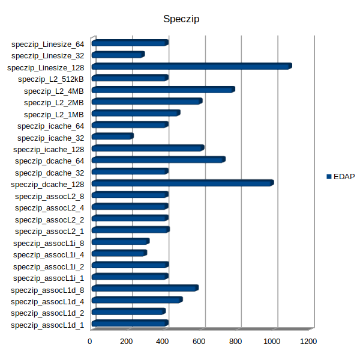
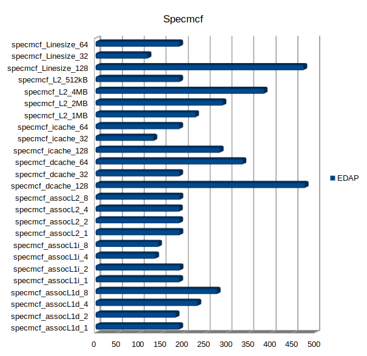
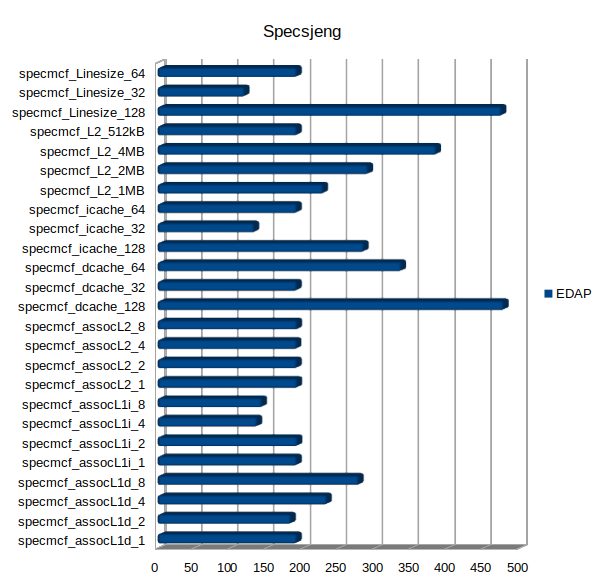
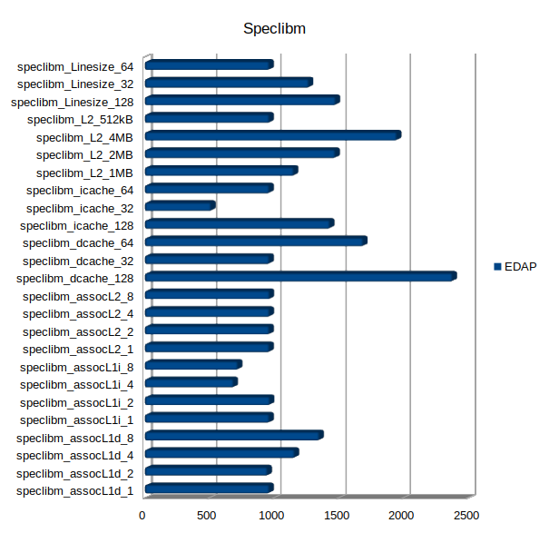
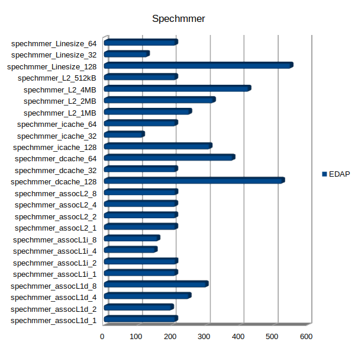

# Readme Lab 3

***

Αυτό το repository έχει δημιουργηθεί στο πλαίσιο του μαθήματος Αρχιτεκτονική Υπολογιστών και αποτελείται από τα αρχεία που απαιτούνται για την απάντηση των ερωτημάτων του φυλλαδίου του δευτέρου εργαστηρίου. Ακολουθεί:

## Βήμα 1ο 
### Ερώτημα 1
Ο όρος dynamic power αναφέρεται στην ισχύς που καταναλώνεται κατά τη φόρτιση και την εκφόρτιση των χωρητικών φορτίων, κατά την αλλαγή κατάστασης του κυκλώματος. Είναι ανάλογη της συνολικής χωρητικότητας του φορτίου, της τάσης τροφοδοσίας, της μεταβολής της τάσης κατά την εν λόγω αλλαγή, της συχνότητας του clock και του παράγοντα δραστηριότητας. 
Ο όρος leakage αναφέρεται στη στατική ισχύ που καταναλώνεται λόγω της διαρροής του ρεύματος μεταξύ των τρανζίστορ. Εξαρτάται από το πλάτος των τρανζίστορ και τη λογική κατάσταση των τοπικών συσκευών. Υπάρχουν δύο μηχανισμοί διαρροής: Subthreshold leakage, το οποίο προκύπτει επειδή υπάρχει μία μικρή ροή ρεύματος μεταξύ του source και του drain στα τρανζίστορ που βρίσκονται σε σε κατάσταση off, και Gate leakage, που αναφέρεται στη διαρροή ρεύματος μέσω του gate terminal.  
Εάν τρέξουμε διαφορετικά προγράμματα σε έναν επεξεργαστή θα επηρεαστεί το dynamic power καθώς θα υπάρχει εκ φύσεως διαφορετική δραστηριότητα αλλαγής κατάστασης των τρανζίστορ σε φυσικό επίπεδο. Επίσης θα υπάρχει ανάλογα με το πρόγραμμα διαφορετική δραστηριότητα στην κρυφή μνήμη επηρεάζοντας με αυτούς τους τρόπους το dynamic power καθώς οι εναλλαγές θα προκαλούν κατανάλωση ισχύος. 

[Πηγή 1](https://www.researchgate.net/publication/221005540_McPAT_An_integrated_power_area_and_timing_modeling_framework_for_multicore_and_manycore_architectures?fbclid=IwAR3UAablrOt6DW4CYdM40D7pQ0VOC2olxDcP789Tn9bobWsBW-_bDgVKGcg)

Η χρονική διάρκεια εκτέλεσης επηρεάζει την κατανάλωση ενέργειας καθώς σε ένα πρόγραμμα το οποίο απαιτεί περισσότερο χρόνο εκτέλεσης, χρειάζονται περισσότεροι κύκλοι για να εκτελεστεί. Αυτό έχει ως αποτέλεσμα την αύξηση της κατανάλωσής της λογω κύκλων. Η ενέργεια είναι ισχύς ανα μονάδα χρόνου Ε = P * t , οπότε η χρονική παράμετρος επηρεάζει την ενέργεια και όχι την ισχύ. Για να επηρεαστεί η ισχύς πρέπει να επηρεαστεί η συχνότητα και φυσικές σχεδιαστικές παραμετροι του επεξεργαστή όπως η πυκνότητα των τρανζιστορ αλλά και η και τάση λειτουργίας.

## Ερώτημα 2

Ένας επεξεργαστής μεγαλύτερης ονομαστικής ισχύος σε ένα σύστημα με ίδια μπαταρία  θα μπορούσε να δίνει μεγαλύτερη διάρκεια λειτουργίας καθώς όπως εξηγήθηκε στο προηγούμενο ερώτημα η ενεργειακή απόδοση είναι διαφορετική από την απόδοση ισχύος. Εαν ο επεξεργαστής μεγαλύτερης ισχύος καταφέρει να λειτουργήσει σε λιγότερες μονάδες χρόνου θα σπαταλήσει λιγότερη ενέργεια. To McPAT δίνει απόδοση ισχύος, δηλαδή το πόσο ενέργεια σπαταλάει ανα μονάδα χρόνου. Λογο αυτού δεν μπορεί να απαντήσει ποιός επεξεργαστής θα ήταν καλύτερος καθώς θα έπρεπε να δίνουμε και την εργασία την οποία θα έπρεπε να εκτελέσουν οι επεξεργαστές έτσι ώστε να υπολογίστει η συνολική ενέργεια η οποία θα καταναλωθεί.

## Ερώτημα 3

Στον φάκελο Lab3 περιέχονται τα αποτελέσματα των προσομοιώσεων με το McPAT. Από τα αποτελέσματα παρατηρούμε πως για την ίδια εφαρμογή ο Xeon σπαταλάει περισσότερη ενέργεια από ότι ο ARM και αυτό φαίνεται εαν βρούμε το άθροισμα των ισχύων.

Ο Xeon καταναλίσκει συνολικά **396 Watt**  
Peak Power = 134.938 W  
Total Leakage = 36.8319 W  
Peak Dynamic = 98.1063 W  
Subthreshold Leakage = 35.1632 W  
Subthreshold Leakage with power gating = 16.3977 W  
Gate Leakage = 1.66871 W  
Runtime Dynamic = 72.9199 W  
  
Ενώ ο ARM **6.5529938 Watt**  
  
Peak Power = 1.74189 W  
Total Leakage = 0.108687 W  
Peak Dynamic = 1.6332 W  
Subthreshold Leakage = 0.0523094 W  
Gate Leakage = 0.0563774 W  
Runtime Dynamic = 2.96053 W  

Αυτό συνεπάγεται πως εάν o Xeon εκτελεί το ίδιο πρόγραμμα  40 φορές πιο γρήγορα από τον ARΜ και υποθέσουμε για λόγους ευκολίας ότι Χeon εκτελεί το πρόγραμμα σε 1 δευτερόλεπτο τότε θα σπαταλήσει **396 Joule**. Ενώ ο ARM θα εκτελέσει το πρόγραμμα σε 40 δευτερόλεπτα και θα σπαταλήσει **262 Joule**. Από αυτό είναι προφανές πως ο Χeon δεν μπορεί να είναι ενεργειακά αποδοτικότερος από τον ARM.

## Βήμα 2ο

### Ερώτημα 1ο

Το Area μπορούμε να το βρούμε στο αρχείο αποτελεσμάτων του mcpat. Το delay είναι το run time του επεξεργαστή δεδομένου του προγράμματος που έχει τρέξει. Μπορούμε να το βρούμε στο stats.txt αρχείο που είναι αποτέλεσμα του Gem5. H ενέργεια η οποία καταναλώνεται μπορεί να υπολογιστει με τον τύπο E = P * t. Όπου Ε-Energy, P-Power,t-time. Είναι το γινόμενο της Ισχύος που μπορεί να βρεθεί από τα αποτελέσματα του mcpat επί τον χρόνο λειτουργίας(Run time).  Για σκοπούς ευκολίας θα χρησιμοποιηθεί το Script print_energy το οποίο παρέχεται για τον υπολογισμό της καταναλισκόμενης ενέργειας.

## Ερώτημα 2ο

Για τον υπολογισμό του EDAP έγινε τροποίηση του python Script print_energy.py. Συγκεκριμένα τροποποιήθηκε έτσι ώστε να εξάγει και τo Area από τα αποτελέσματα του mcpat και να υπολογίζει το γινόμενο Energy-Deleay-Area. Με την βοήθεια ενός script σε bash έγινε αυτοματοποίηση όλων των υπολογισμών γινομένων από όλα τα benchmarks του προηγούμενου εργαστηρίου και γίνεται απόθεση τους στο EDAP_Results.txt.   
Στον φάκελο Lab3 παρέχονται στον φάκελο *Tests* όλα τα αρχεία τα οποία χρειάζονται για να γίνει αυτοματοποίηση της διαδικασίας **εκτός από το mcpat**. Στον φάκελο *Benches* περιέχονται ξανά τα αρχεία αποτελεσμάτων των Benchmarks του Lab2 και στον φάκελο *Results* παρέχονται το *EDAP_calc_script.sh* όπου  είναι το κυριο Script, το *print_energy.py* που είναι το τροποποιημένο Script το οποίο τυπώνει το EDAP αντί για την ενέγεια, το *GEM5ToMcPAT.py* το οποίο είναι απαράλλακτο όπως επίσης το *inorder_arm.xml* για σκοπούς ευκολίας.  
Στο αρχείο *EDAP_Results.txt* περιέχονται τα EDAP για κάθε benchmark του Lab2. Τα αποτελέσματα παρατείθονται σε μορφή γραφημάτων κάτωθι. Βρίσκονται επίσης στον φάκελο *Lab3/Charts*. 

+ Linesize  
Παρατηρείται πως το EDAP είναι μικρότερο για Linesize 32 σε όλα τα Benchmarks εκτός για το Speclibm. Μαζι με την χωρητικότητα της icache επηρεάζει περισσότερο το γινόμενο EDA.
+ L2  
Το EDAP είναι μικρότερο για μικρότερες τιμές χωρητικότητας L2 ενώ το Associativity δεν επηρεάζει καθόλου το EDAP.
+ icache  
Για μικρότερη τιμή χωρητικότητας το EDAP είναι μικρότερο ενώ τείνει να έχει μικρότερο EDAP για Associativity 4 και 8. Μαζί με το Line size επηρεάζει περισσοτερο το EDAP.
+ dcache  
Για χωρητικότητα 32 το EDAP είναι μικρότερο, ακολουθεί η χωρητικότητα 128 και μετά για 64 όπου είναι μεγαλύτερο. Το associativity είναι μικρότερο για τιμή 2 έπειτα 1 και τέλος 4 και 8

Όσον αφορά το Power, αλλά και το Αrea, είναι παράγοντες οι οποίοι εξαρτώνται από τα φυσικά χαρακτηριστικά του επεξεργαστή και είναι ίδια στα διαφορετικά benchmarks αλλά για ίδια χαρακτηριστικά. Αυτό έχει ως αποτέλεσμα το γινόμενο EDAP να κρίνεται στο Delay, εφόσον είναι ο μόνος μη σταθερός παράγοντας.

### Ερώτημα 3

Παρατηρείται πως το γινόμενο επηρεάζεται από το LineSize σε μεγαλύτερο βαθμό ενώ μετά ακόλουθεί το icache size. Στην συνάρτηση κόστους υπολογίστηκε ότι ο μεγαλύτερος παράγοντας που συμβάλει στο κόστος είναι το LineSize και μετά τα φυσικά χαρακτηριστικά της L1. Παρατηρούμε πως τα πιο κοστοβόρα χαρακτηριστικά, συμβάλλουν σε μεγάλο βαθμό στην ενεργειακή απόδοση του επεξεργαστή. Παρατηρείται πως το μέγεθος της L2 επηρεάζει το γινόμενο EDA αλλά, δεν επηρέαζει την απόδοση CPI στην προηγούμενη άσκηση. Για την υλοποίηση ενός αποδοτικού σε CPI αλλά μπορεί να βρεθεί μια μέση λύση με linesize 64 , L2 512KB και Associativity 1 , Icache size 64 με associativity 4 και Dcache 64 με associativity 2.
